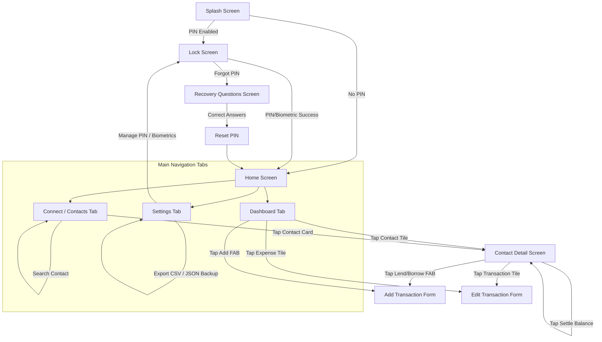

# 📱 To-Do / Finance & Debt Tracker — Complete App Flow & Documentation

## 📌 Overview & Purpose

The **To-Do / Finance & Debt Tracker** is a Flutter mobile application designed to simplify personal financial management and peer-to-peer debt tracking. It serves two main financial use cases:

1. **Cash Flow Tracking**: Managing daily **Income** and **Expenses** categorized by spending types (e.g., Food, Salary, Utilities, Shopping).
2. **Contact Debt Ledger**: Tracking money **Lent** to or **Borrowed** from personal contacts with auto-calculated net balances and 1-tap debt settlement.

The app places high emphasis on **user privacy** (offline-first local Hive storage, optional PIN & Biometric security), **modern design** (glassmorphism UI, smooth entrance motions, Hero animations), and **data portability** (CSV statement export & JSON backup/restore).

---

## 🗺️ Screen Navigation & User Flow Diagram



---

## ⭐ Comprehensive Feature Breakdown

### 1. 💰 Income & Expense Management
- **Add & Edit**: Simple, clean forms ([form_screen.dart](file:///c:/Users/Asus/Downloads/to_do/to_do/lib/screen/form_screen.dart) and [edit_expense_screen.dart](file:///c:/Users/Asus/Downloads/to_do/to_do/lib/screen/edit_expense_screen.dart)) for recording transactions.
- **Smart Category Selector**: Filter or create custom categories with autocomplete suggestions saved to settings ([category_field.dart](file:///c:/Users/Asus/Downloads/to_do/to_do/lib/widget/category_field.dart)).
- **Auto Title Assignment**: Income and Expense titles are automatically derived from the selected Category or Type to streamline entry.

### 2. 🤝 Peer-to-Peer Contact Debt Ledger
- **Lent & Borrowed Transactions**: Track money given to or received from contacts ([contact_detail_screen.dart](file:///c:/Users/Asus/Downloads/to_do/to_do/lib/screen/contact_detail_screen.dart)).
- **Net Contact Balance**: Real-time calculation showing if a contact owes you or if you owe them.
- **1-Tap Debt Settlement**: A *"Settle"* action button automatically computes and adds the balancing counter-transaction to bring the net debt to $0.00.

### 3. 📊 Dashboard Analytics & Period Filtering
- **Summary Header Card**: Displays Total Available Balance, Income, Expense, Lent, Borrowed, and Net Lending ([expense_summary_card.dart](file:///c:/Users/Asus/Downloads/to_do/to_do/lib/widget/expense_summary_card.dart)).
- **Visual Cash Flow Ratio Bar**: A visual progress ratio bar indicating the proportion of Income vs Expense.
- **Month & All-Time Selector**: Filter transactions by specific calendar months or view All-Time totals.
- **Category Filter Chips**: Filter the dashboard feed instantly by specific categories (*All, Food, Salary, Shopping, etc.*).

### 4. 🔒 App Security & Privacy
- **PIN Lock & Throttling**: 4-digit PIN protection ([lock_screen.dart](file:///c:/Users/Asus/Downloads/to_do/to_do/lib/screen/lock_screen.dart)) with temporary lockout after failed attempts.
- **Biometric Unlock**: Fingerprint / Face unlock support via `local_auth`.
- **Security Recovery Questions**: Backup security questions ([recovery_questions_screen.dart](file:///c:/Users/Asus/Downloads/to_do/to_do/lib/screen/recovery_questions_screen.dart)) to safely reset forgotten PINs.

### 5. 📄 Data Portability & Backup
- **CSV Statement Export**: Export complete transaction history into CSV format for accounting ([report_helper.dart](file:///c:/Users/Asus/Downloads/to_do/to_do/lib/utils/report_helper.dart)).
- **JSON Backup & Restore**: Copy JSON backups to clipboard or restore database state from JSON text in [settings_screen.dart](file:///c:/Users/Asus/Downloads/to_do/to_do/lib/screen/settings_screen.dart).

---

## 📂 Codebase Directory & File Reference

```
lib/
├── data/
│   ├── expense_repository.dart    # Local Hive box CRUD operations for Expense objects
│   ├── security_repository.dart   # Encrypted PIN & Security question storage
│   └── settings_repository.dart   # App settings, currency & saved categories
├── model/
│   ├── expense_model.dart         # Hive model schema for Expense (title, amount, date, type, etc.)
│   └── expense_model.g.dart       # Generated Hive TypeAdapter
├── screen/
│   ├── connect_screen.dart        # Contacts list view & search tab
│   ├── contact_detail_screen.dart # Individual contact ledger & debt settlement screen
│   ├── edit_expense_screen.dart   # Edit transaction screen
│   ├── forgot_pin_screen.dart     # Forgotten PIN recovery workflow
│   ├── form_screen.dart           # Add transaction screen (AddTodoScreen)
│   ├── home_screen.dart           # Main application dashboard & tab controller
│   ├── lock_screen.dart           # App lock screen (PIN & Biometric)
│   ├── recovery_questions_screen.dart # Setup/manage recovery security questions
│   ├── settings_screen.dart       # App settings, currency, security & backup tab
│   └── splash_screen.dart         # Startup splash & auth route check
├── utils/
│   ├── app_colors.dart            # Centralized color theme palette
│   ├── app_design.dart            # Design tokens, radii, spacing, and glass backgrounds
│   ├── app_motion.dart            # Animation curves and entrance motions
│   ├── app_snackbar.dart          # Custom toast & snackbar feedback notifications
│   ├── app_transitions.dart       # Custom screen transition route animations
│   ├── category_helper.dart       # Helper for parsing & formatting Category & Reason strings
│   ├── contact_identity.dart      # Contact phone & name matching logic
│   ├── currency_helper.dart       # Currency formatting helper
│   ├── delete_restore.dart        # Swipe-to-delete with undo logic
│   ├── expense_period.dart        # Period filtering logic (months/all-time)
│   ├── expense_validation.dart    # Form input validation logic
│   ├── report_helper.dart         # CSV statement generation & JSON backup/restore helper
│   └── transaction_type.dart      # Transaction types (Income, Expense, Lent, Borrowed)
└── widget/
    ├── app_nav_bar.dart           # Glassmorphic bottom navigation bar
    ├── category_field.dart        # Category autocomplete & chip selector widget
    ├── expense_summary_card.dart  # Summary metrics & visual ratio bar card
    ├── expense_tile.dart          # Transaction list tile with swipe actions
    ├── expense_type_field.dart    # Transaction type dropdown selector
    ├── glass_widgets.dart         # Reusable glassmorphic UI components (GlassCard, GlassInput, etc.)
    └── transaction_form.dart      # Shared form component for Add and Edit screens
```

---

## ⚙️ Data Storage Model

Transactions are stored locally in Hive under box name `expenses_box` using [expense_model.dart](file:///c:/Users/Asus/Downloads/to_do/to_do/lib/model/expense_model.dart):

| Field | Type | Description |
| :--- | :--- | :--- |
| `title` | `String` | Title or Contact Name |
| `amount` | `double` | Numeric monetary amount |
| `date` | `String` | Date formatted as `YYYY-MM-DD` |
| `type` | `String` | `'Income'`, `'Expense'`, `'Lent'`, or `'Borrowed'` |
| `contactName` | `String?` | Name of contact (for Lent/Borrowed transactions) |
| `phoneNumber` | `String?` | Phone number of contact |
| `reason` | `String?` | Formatted as `"Category: <Cat> \| <Note>"` |
